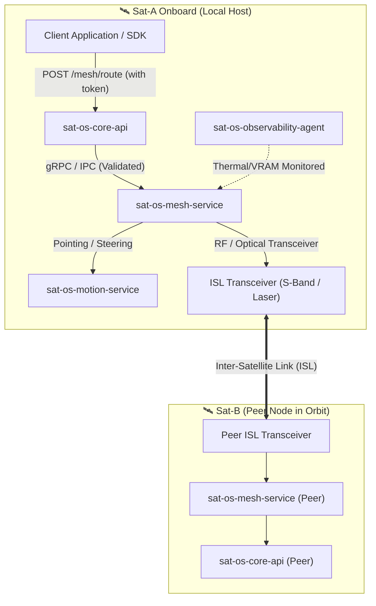

# sat-os-mesh-service

> Inter-Satellite Link (ISL) orchestration and orbital mesh networking microservice for distributed in-space compute and peer-to-peer satellite data routing.

## Purpose and Architecture Position
The `sat-os-mesh-service` enables satellites in a constellation to discover peers, schedule optical/RF Inter-Satellite Links (ISL), and exchange telemetry, raw frames, or processed analytical payloads directly in orbit without passing through ground stations. 

Operating under the strict Zero Trust model, it receives authenticated and validated routing requests **exclusively** from `sat-os-core-api` and drives the low-level physical pointing and transceiver hardware through an isolated Hardware Abstraction Layer (HAL).



---

## Tech Stack
| Component | Technology | Description |
|---|---|---|
| **Core Daemon** | C++20 / Go | High-throughput packet serialisation and routing engine |
| **Control Interface** | gRPC / Protocol Buffers | Internal IPC contract with `sat-os-core-api` |
| **Physical Layer Driver** | Linux SocketCAN / SPI / Serial | Direct transceiver control via isolated HAL |
| **Mesh Protocol** | Delay/Disruption Tolerant Networking (DTN / Bundle Protocol RFC 5050/9171) | Reliable store-and-forward routing in dynamic orbital topologies |
| **Containerisation** | Docker (ARM64 for Jetson) | Isolated deployment with strict resource cgroups |

---

## Inputs & Outputs
| Flow | Interface | Data Description |
|---|---|---|
| **Inputs** | gRPC (`sat-os-core-api`) | Validated packet dispatch commands, target peer IDs, QoS priority, payload bytes |
| **Inputs** | Orbital Ephemeris (Local Cache) | Stored orbital state vectors for relative geometry and line-of-sight tracking |
| **Inputs** | Physical Transceiver RX | Inbound demodulated packets from peer satellites |
| **Outputs** | Physical Transceiver TX | Outbound frame stream encoded with Reed-Solomon/LDPC FEC |
| **Outputs** | gRPC (`sat-os-core-api`) | Inbound data delivery callbacks, contact window notifications, link telemetry |
| **Outputs** | HAL Commands (`sat-os-motion-service`) | Ephemeris-driven fine-pointing requests for optical terminal tracking |

---

## Client API Permissions & Constraints
Clients access mesh capabilities **only through `sat-os-core-api`**:
- `GET /mesh/peers`: List satellites currently within line-of-sight and contact windows.
- `GET /mesh/status`: Current link quality, BER (Bit Error Rate), queue depth.
- `POST /mesh/transmit`: Submit data bundle for orbital forwarding (payload size capped by energy budget).
- `PUT / PATCH / DELETE`: **FORBIDDEN (405 Method Not Allowed)**. Hardware routing tables and radio calibration cannot be modified by client code.

---

## Getting Started

### Prerequisites
- JetPack SDK 5.x / 6.x (ARM64) or Linux x86_64 emulator
- CMake 3.22+, GCC/Clang with C++20 support
- Protocol Buffers & gRPC development tools

### Build
```bash
mkdir build && cd build
cmake -DCMAKE_BUILD_TYPE=Release ..
make -j$(nproc)
```

### Run (Local Test Harness)
```bash
./bin/sat-os-mesh-service --config config/test-mesh.json --mock-transceiver
```

---

## Project Structure
```text
sat-os-mesh-service/
├── cmake/               # CMake modules and toolchain files
├── protos/              # Protocol buffer definitions (mesh_service.proto)
├── src/
│   ├── core/            # DTN bundle routing and queue manager
│   ├── hal/             # Hardware Abstraction Layer (Laser/RF drivers)
│   ├── ephemeris/       # Relative geometry and line-of-sight calculator
│   ├── server/          # gRPC IPC server implementation
│   └── main.cpp         # Service entrypoint and signal handling
├── tests/
│   ├── unit/            # Packet encoding, routing table tests
│   └── integration/     # Simulated two-satellite transmission tests
├── Dockerfile           # Multi-stage ARM64 build
└── README.md
```

---

## CI/CD Pipeline (GitHub Actions)


---

## Related Repositories
- [sat-os-core-api](../sat-os-core-api): The single entry gateway through which client requests reach this service.
- [sat-os-motion-service](../sat-os-motion-service): Cooperates for optical line-of-sight fine steering.
- [sat-os-observability-agent](../sat-os-observability-agent): Monitors transceiver thermal output and power consumption.
- [sat-orbit-simulator](../sat-orbit-simulator): Generates precomputed ISL contact windows uploaded to the satellite.
